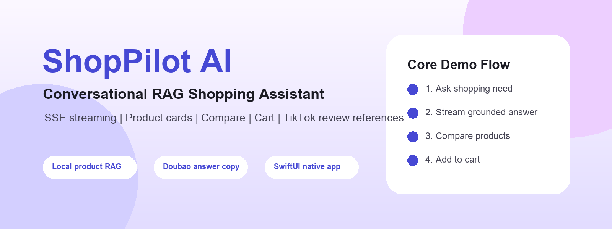

# ShopPilot AI



ShopPilot AI 是一个基于本地商品数据集、RAG 检索和 AI Agent 编排的对话式电商智能导购助手 Demo。项目同时交付 Expo/Web 快速演示端和纯 SwiftUI iOS 原生端。

## 核心能力

- 自然语言商品推荐：理解预算、场景、偏好、排除条件和多轮追问。
- 可信 RAG grounding：商品名称、价格、图片、测评链接等事实均来自本地 `ecommerce_agent_dataset`。
- SSE 流式体验：`/api/chat` 支持 `meta`、`delta`、`final`、`done`、`error` 事件。
- 决策闭环：商品卡片、详情 Sheet、对比面板、购物车抽屉。
- 测评参考：商品可返回 TikTok 等外部图文/视频链接作为真实参考。
- 原生移动端：`ios/ShopPilotNative` 使用 SwiftUI + URLSession，无第三方依赖。

## 工程入口

- `server/`：FastAPI 后端，负责数据治理、检索、Agent 编排、API、SSE 和购物车状态。
- `client/`：Expo / React Native / Web 客户端，负责演示、GIF 录制和公网 Web 部署。
- `ios/ShopPilotNative/`：纯 SwiftUI 原生 App 与 `ShopPilotCore` 解析/状态层。
- `ecommerce_agent_dataset/`：原始商品数据集，后端可直接从 raw dataset 兜底加载。
- `docs/`：架构、API、部署、benchmark、移动端说明和提交材料。
- `scripts/`：本地启动、数据导入、benchmark 和交付资产生成脚本。
- `api/index.py`：Vercel FastAPI Python Function 入口。

## 快速开始

```bash
cd /Users/bytedance/Desktop/ShoPilot
python3 -m pip install -r server/requirements.txt
python3 scripts/ingest_dataset.py
./scripts/dev_server.sh
```

另开终端启动 Web：

```bash
cd /Users/bytedance/Desktop/ShoPilot/client
npm install
npm run web
```

验证 API：

```bash
curl http://127.0.0.1:8000/health
curl -X POST http://127.0.0.1:8000/api/chat -H 'Content-Type: application/json' -d '{"session_id":"demo","message":"推荐一款 200 元以内的咖啡","stream":false}'
```

## 模型配置

- 模型服务：火山 Ark 兼容接口
- 模型名称：Doubao-Seed-2.0-lite
- 模型 ID：`ep-20260514111645-lmgt2`
- Base API：`https://ark.cn-beijing.volces.com/api/v3/`
- API Key：仅写入本地 `server/.env` 或 Vercel 环境变量 `LLM_API_KEY`，不要提交到仓库或展示在录屏中。

没有密钥时，后端使用本地 RAG + 模板回答兜底，商品推荐链路仍可运行。

## 测试与验证

```bash
cd /Users/bytedance/Desktop/ShoPilot
python3 -m pytest server/tests
python3 scripts/run_benchmark.py
python3 scripts/generate_delivery_assets.py
cd client && npm run typecheck && npm run build:web
cd ../ios/ShopPilotNative && swift build --disable-sandbox --target ShopPilotCore && swift build --disable-sandbox --target ShopPilotNativeApp
```

当前 Command Line Tools 环境缺少可用 `XCTest` 模块，Swift 单测文件已提供，完整 `swift test` 建议在完整 Xcode + iPhone SDK 环境中执行。

## 交付资产

- Poster：`docs/assets/poster.png`
- Banner：`docs/assets/banner.png`
- Core Flow GIF：`docs/assets/shoppilot-core-flow.gif`
- Benchmark JSON：`docs/assets/benchmark_results.json`

## 文档

- API：`docs/API_SPEC.md`
- 架构：`docs/ARCHITECTURE_GUIDE.md`
- 设计：`docs/DESIGN_DOC.md`
- 移动端：`docs/MOBILE_DEV_SETUP.md`
- 部署：`docs/DEPLOYMENT.md`
- Benchmark：`docs/BENCHMARK.md`
- 提交材料：`docs/SUBMISSION.md`
