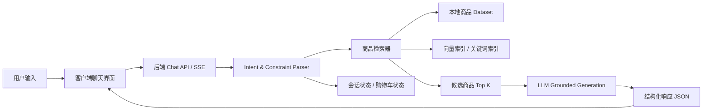

# 多模态电商智能导购 AI Agent 项目协作说明文档

> 面向对象：Mira / Stitch / Trae / 后续参与开发的其他 AI。  
> 目标：在今晚 12:00 前完成一个可演示、可提交、可解释的「对话式推荐电商导购助手」MVP。

---

## 0. 一句话项目定义

本项目要交付一个基于 **RAG + AI Agent + 商品结构化数据** 的电商导购助手：用户用自然语言提出购买需求，系统理解意图、检索本地商品数据集、生成有依据的推荐理由，并在对话流中展示可点击商品卡片、支持多轮追问与基础购物车操作。

课题要求的核心是将传统“展示型广告”升级为“交互型导购”，完成从内容浏览到购买决策的深度连接[[课题说明会：基于 RAG 的多模态电商智能导购 AI Agent](https://bytedance.larkoffice.com/docx/PupqdQ6kmoJAmaxW6U0c22RKnNb)。

---

## 1. 背景与约束

### 1.1 课题背景

课题要求构建一个多模态电商智能导购 AI Agent，覆盖 **数据治理、RAG 检索、模型/Agent 编排、后端服务化、客户端体验** 等环节。最小闭环要求包括：客户端对话入口、后端 RAG 链路、流式 API、商品卡片展示、模型不编造虚假商品信息[[课题说明会：基于 RAG 的多模态电商智能导购 AI Agent](https://bytedance.larkoffice.com/docx/PupqdQ6kmoJAmaxW6U0c22RKnNb)。

### 1.2 当前团队计划

- **Mira**：负责项目说明文档、架构规划、提示词、提交文档素材。
- **Stitch**：负责项目 UI/前端创作，并接入 Figma。
- **Trae**：负责项目开发实现、接口联调、Demo 录制。
- **用户本人**：最终审核、把关提交质量。

### 1.3 时间约束

交付截止时间：**今晚 12:00**。因此必须采取 **Demo-first / Vibe Coding / 最小闭环优先** 策略：先跑通端到端，再补充亮点和文档。

### 1.4 数据集状态

用户已将商品信息 dataset 下载到本地，但当前文档生成环境未读取到该本地数据文件。因此本文档使用通用字段约定，开发时请以实际 dataset 字段为准做字段映射。

课题建议数据量为 **50–100 条脱敏电商数据**，字段至少包含商品名、类目、价格、详情描述、主图 URL[[课题说明会：基于 RAG 的多模态电商智能导购 AI Agent](https://bytedance.larkoffice.com/docx/PupqdQ6kmoJAmaxW6U0c22RKnNb)。

---

## 2. 项目定位与 MVP 范围

### 2.1 项目名称建议

**ShopPilot AI：对话式电商智能导购助手**

备选名称：

1. **BuyBuddy AI**
2. **RAGMall Assistant**
3. **灵购 AI 导购助手**

### 2.2 MVP 必须完成

1. **对话式推荐**
   - 用户输入自然语言需求。
   - Agent 识别商品类目、预算、偏好、排除项、使用场景。
   - 返回 3 个以内推荐商品。

2. **RAG 商品检索**
   - 读取本地商品 dataset。
   - 将商品信息做文本化、向量化或轻量语义检索。
   - 推荐只能来自 dataset，不允许编造不存在的商品、价格、优惠或库存。

3. **多轮上下文**
   - 支持用户继续说“再便宜点”“不要这个品牌”“适合油皮吗”。
   - 能基于上一轮上下文收敛推荐。

4. **商品卡片展示**
   - 对话回复中展示商品卡片：主图、名称、价格、类目、推荐理由、操作按钮。
   - 支持“加入购物车 / 查看详情 / 对比”。

5. **流式体验**
   - 后端提供 SSE 或模拟流式输出。
   - 前端实现逐字/分段渲染，提升演示观感。

6. **基础购物车操作**
   - 支持“把第一个加入购物车”。
   - 支持查看购物车。
   - 支持删除购物车中的某个商品。

### 2.3 建议加分项，只做 1–2 个

由于时间紧，建议优先做：

1. **反选 / 排除约束**
   - 示例：“推荐防晒霜，但不要含酒精，也不要日系品牌。”
   - 这是课题明确的加分方向，展示 Agent 对否定语义的理解能力[[课题说明会：基于 RAG 的多模态电商智能导购 AI Agent](https://bytedance.larkoffice.com/docx/PupqdQ6kmoJAmaxW6U0c22RKnNb)。

2. **多商品对比**
   - 示例：“A 和 B 哪个更适合通勤？”
   - 输出结构化对比表和明确推荐结论。

3. **模拟多模态图片找货**
   - 如果时间不够，不接真实 VLM。
   - 可以做“上传图片 → 前端预览 → 让用户补充描述 → 文本 RAG 检索”的半模拟链路。

---

## 3. 推荐技术方案

### 3.1 总体技术路线

采用 **轻量本地 RAG + LLM 生成 + 前端商品卡片渲染**。



### 3.2 推荐技术栈

| 模块 | 推荐方案 | 原因 |
|---|---|---|
| 客户端 | React Native / Expo，或 iOS Swift 最小 Demo | 课题强调原生体验；若时间极紧，可用 Expo 快速交付移动端形态 |
| UI 设计 | Stitch + Figma | 快速生成高保真移动端界面 |
| 后端 | Python FastAPI | RAG、数据处理、SSE 开发最快 |
| 向量检索 | Chroma / FAISS / sklearn TF-IDF fallback | 本地快速搭建，适合 50–100 条数据 |
| LLM | 通过环境变量配置课题提供的模型服务 | 避免密钥进入代码仓库 |
| 数据存储 | JSON / SQLite | Demo 场景足够，便于检查 |
| Demo 录制 | Trae 运行 + 屏幕录制 | 3–5 分钟讲清链路即可 |

> 安全要求：不要把任何 API Key、Token 或内部密钥写入 README、提交文档、GitHub、前端代码或录屏画面。统一使用 `.env`，并把 `.env` 放入 `.gitignore`。

---

## 4. 目录结构建议

```text
shop-pilot-ai/
  client/
    app/
    components/
      ChatBubble.tsx
      ProductCard.tsx
      CartDrawer.tsx
      ComparePanel.tsx
    screens/
      ChatScreen.tsx
      ProductDetailScreen.tsx
    package.json
  server/
    app.py
    config.py
    requirements.txt
    .env.example
    data/
      products_raw.csv 或 products_raw.json
      products_normalized.json
    rag/
      ingest.py
      retriever.py
      ranker.py
      prompt.py
      schemas.py
    agent/
      intent.py
      dialogue_state.py
      cart_tools.py
      response_builder.py
    tests/
      test_retriever.py
      test_agent_cases.py
  docs/
    PROJECT_PLAN.md
    DESIGN_DOC.md
    DEMO_SCRIPT.md
    SUBMISSION.md
  README.md
  .gitignore
```

---

## 5. 数据规范与 RAG 设计

### 5.1 商品数据标准字段

开发时将本地 dataset 映射成以下标准结构：

```json
{
  "id": "p001",
  "name": "商品名称",
  "category": "类目",
  "brand": "品牌，可选",
  "price": 199.0,
  "currency": "CNY",
  "description": "商品详情描述",
  "features": ["卖点1", "卖点2"],
  "image_url": "https://...",
  "tags": ["油皮", "通勤", "学生党"],
  "inventory": "in_stock",
  "rating": 4.8,
  "source": "local_dataset"
}
```

### 5.2 商品文本化策略

每个商品拼接为可检索文本：

```text
商品名：{name}
品牌：{brand}
类目：{category}
价格：{price}
描述：{description}
卖点：{features}
标签：{tags}
适用场景：{scenario_tags}
限制信息：库存={inventory}
```

### 5.3 检索策略

建议实现双阶段检索：

1. **结构化过滤**
   - 预算：`price <= max_price`
   - 类目：匹配 category
   - 排除：brand / ingredient / tag not in excludes
   - 场景：tags 包含或相似

2. **语义召回**
   - 首选 embedding + Chroma / FAISS。
   - 如果 embedding 来不及，使用 TF-IDF / BM25 也可。
   - 数据量只有 50–100 条时，轻量方案足够演示。

3. **排序规则**
   - 语义相似度：50%
   - 约束匹配度：30%
   - 价格/评分/标签补充：20%

### 5.4 Chunking 策略

每个商品作为一个 chunk，不建议拆太细。原因：商品推荐需要完整上下文，包括价格、类目、描述、主图 URL 和卖点。课题也强调要合理切分商品信息粒度，平衡召回率与精确度[[课题说明会：基于 RAG 的多模态电商智能导购 AI Agent](https://bytedance.larkoffice.com/docx/PupqdQ6kmoJAmaxW6U0c22RKnNb)。

---

## 6. Agent 能力设计

### 6.1 意图类型

```ts
type Intent =
  | "recommend"        // 推荐商品
  | "filter"           // 补充筛选条件
  | "compare"          // 商品对比
  | "detail"           // 查看详情
  | "add_to_cart"      // 加入购物车
  | "remove_from_cart" // 移除购物车
  | "view_cart"        // 查看购物车
  | "clarify"          // 主动追问
  | "smalltalk";
```

### 6.2 约束结构

```json
{
  "category": "跑鞋",
  "budget_max": 500,
  "budget_min": null,
  "preferences": ["轻量", "适合通勤"],
  "exclusions": ["不要日系品牌", "不要含酒精"],
  "scenario": "下周去三亚度假",
  "target_user": "油皮用户",
  "compare_targets": ["p001", "p002"],
  "sort_by": "relevance"
}
```

### 6.3 会话状态

```json
{
  "session_id": "demo-session",
  "last_intent": "recommend",
  "last_constraints": {},
  "last_recommended_products": ["p001", "p002", "p003"],
  "cart": [
    {"product_id": "p001", "quantity": 1}
  ]
}
```

### 6.4 决策逻辑

1. 如果用户需求不完整但仍可检索：先推荐，再补充一句可继续筛选。
2. 如果类目完全不明确：主动追问 1 个关键问题。
3. 如果用户表达“不要 / 排除 / 除了”：必须进入 exclusion 过滤。
4. 如果用户说“第一个 / 刚才那个”：从 `last_recommended_products` 解析引用。
5. 如果检索结果不足：说明“当前数据集中没有完全匹配”，并给出最接近候选。
6. 所有商品事实必须来自检索结果，不允许编造。

---

## 7. 后端 API 设计

### 7.1 Chat API

`POST /api/chat`

请求：

```json
{
  "session_id": "demo-session",
  "message": "推荐一款适合油皮的洗面奶，200 元以内",
  "stream": true
}
```

响应建议：

```json
{
  "type": "final",
  "message": "我从当前商品库里筛选了 3 款更适合油皮、预算 200 元以内的洗面奶。",
  "products": [
    {
      "id": "p001",
      "name": "xxx 洗面奶",
      "price": 129,
      "category": "洁面",
      "image_url": "https://...",
      "reason": "控油清洁力较强，价格在预算内，适合日常使用。"
    }
  ],
  "suggested_actions": ["加入第一个到购物车", "对比前两款", "再便宜一点"]
}
```

### 7.2 商品详情 API

`GET /api/products/{product_id}`

返回商品完整信息。

### 7.3 购物车 API

- `GET /api/cart?session_id=demo-session`
- `POST /api/cart/items`
- `PATCH /api/cart/items/{product_id}`
- `DELETE /api/cart/items/{product_id}`

### 7.4 数据导入 API，可选

`POST /api/admin/ingest`

用于重新读取本地 dataset 并构建索引。

---

## 8. 前端 / Stitch 设计说明

### 8.1 页面结构

1. **启动页 / 首页**
   - 标题：ShopPilot AI
   - 副标题：会聊天、懂商品、能帮你做购买决策
   - 快捷问题卡片：
     - “推荐 200 元以内的蓝牙耳机”
     - “油皮适合什么洗面奶？”
     - “帮我搭一套三亚旅行好物”

2. **聊天页**
   - 顶部：Agent 名称 + 在线状态。
   - 中部：聊天消息流。
   - 商品推荐以横向卡片嵌入 assistant message。
   - 底部：输入框 + 图片上传按钮 + 语音按钮占位。

3. **商品详情弹层**
   - 商品图、价格、标签、详情、推荐理由。
   - 按钮：加入购物车 / 返回对话。

4. **购物车抽屉**
   - 展示已加入商品。
   - 支持删除、数量加减。
   - 模拟“确认下单”按钮。

### 8.2 视觉风格

- 风格：年轻、轻电商、AI 助手感。
- 主色：蓝紫渐变或绿色电商感。
- 组件：圆角商品卡、柔和阴影、流式 typing 状态、推荐标签 chips。
- 重点演示：商品卡片在对话中自然出现，而不是跳转到传统列表页。

### 8.3 Stitch 给 Trae 的交付内容

- Figma 页面：启动页、聊天页、商品详情弹层、购物车抽屉。
- 组件标注：ProductCard、ChatBubble、QuickPrompt、CartDrawer。
- 状态标注：loading、streaming、empty、error、cart added。

---

## 9. Trae 开发任务拆解

### 9.1 P0：必须今晚完成

1. 初始化项目目录。
2. 后端读取本地商品 dataset，统一字段。
3. 实现检索：结构化过滤 + TF-IDF / embedding 召回。
4. 实现 `/api/chat`。
5. 实现 Agent Prompt 和响应 JSON。
6. 前端聊天页接入 `/api/chat`。
7. 渲染商品卡片。
8. 实现购物车本地状态或后端 session 状态。
9. 准备 5 条演示问题。
10. 录制 Demo。

### 9.2 P1：有时间再做

1. SSE 真流式输出。
2. 多商品对比面板。
3. 图片上传找同款的模拟链路。
4. 推荐结果缓存。
5. 单元测试和评测脚本。

### 9.3 P2：不建议今晚做

1. 真实支付 / 真实下单。
2. 完整用户登录。
3. 真实库存同步。
4. 复杂多模态 VLM 检索。
5. 过度复杂的 LangChain 多 Agent 编排。

---

## 10. 核心 Prompt 设计

### 10.1 System Prompt

```text
你是 ShopPilot AI，一个严谨、可信、会对话的电商智能导购助手。

你的任务：
1. 根据用户需求，从已检索到的商品候选中推荐最合适的商品。
2. 必须基于商品候选信息作答，不得编造不存在的商品、价格、优惠、库存、品牌、功效或参数。
3. 如果候选商品无法完全满足用户需求，要明确说明“当前商品库中没有完全匹配项”，并给出最接近的选择。
4. 如果用户需求不明确，优先提出 1 个最关键的澄清问题；如果已有足够信息，则直接推荐。
5. 能理解预算、类目、品牌、使用场景、偏好、排除项、比较诉求和购物车操作。
6. 对推荐结果给出简洁、可验证、面向购买决策的理由。
7. 输出必须符合指定 JSON Schema，不要输出多余文本。

重要约束：
- 只能推荐 context_products 中存在的商品。
- 商品 ID、名称、价格、图片 URL 必须原样来自 context_products。
- 不要承诺真实优惠、真实库存、真实配送时效。
- 对医疗、美容功效等敏感效果避免绝对化表达。
```

### 10.2 User Prompt Template

```text
用户当前输入：
{user_message}

会话状态：
{dialogue_state}

已解析约束：
{constraints}

检索到的商品候选 context_products：
{retrieved_products_json}

请完成：
1. 判断用户意图。
2. 如果是推荐，选择最多 3 个商品。
3. 如果是对比，生成结构化对比。
4. 如果是购物车操作，返回 action。
5. 生成自然、简洁、可信的中文回复。
6. 严格按 JSON Schema 输出。
```

### 10.3 JSON 输出 Schema

```json
{
  "intent": "recommend | compare | add_to_cart | remove_from_cart | view_cart | clarify | detail | smalltalk",
  "answer": "给用户看的自然语言回复",
  "products": [
    {
      "id": "商品ID",
      "name": "商品名称",
      "price": 199,
      "image_url": "https://...",
      "reason": "推荐理由，必须来自商品信息和用户需求的匹配"
    }
  ],
  "comparison": [
    {
      "dimension": "价格",
      "items": [
        {"product_id": "p001", "value": "199 元"},
        {"product_id": "p002", "value": "249 元"}
      ]
    }
  ],
  "cart_action": {
    "type": "none | add | remove | update | view",
    "product_id": "p001",
    "quantity": 1
  },
  "clarifying_question": "如果需要追问，填这里，否则为空字符串",
  "suggested_actions": ["再便宜一点", "对比前两款", "加入第一个到购物车"]
}
```

### 10.4 意图解析 Prompt

```text
请从用户输入中抽取电商导购相关意图和约束。

用户输入：{user_message}
上一轮上下文：{dialogue_state}

输出 JSON：
{
  "intent": "recommend/filter/compare/detail/add_to_cart/remove_from_cart/view_cart/clarify/smalltalk",
  "category": null,
  "budget_min": null,
  "budget_max": null,
  "brand_preferences": [],
  "preferences": [],
  "exclusions": [],
  "scenario": null,
  "target_user": null,
  "referenced_product_position": null,
  "compare_targets": []
}

规则：
- “不要、排除、不含、除了、不想要”后的内容进入 exclusions。
- “第一个、第二个、刚才那款”要转换成 referenced_product_position。
- 不确定就填 null 或空数组，不要猜。
```

### 10.5 推荐理由 Prompt 规则

推荐理由必须遵守：

```text
推荐理由 = 用户需求匹配点 + 商品事实 + 购买决策价值
不要写空泛形容词。
不要写商品数据中没有的功效。
不要写“全网最低价”“官方正品”“库存充足”等无法验证信息。
```

示例：

```text
推荐它是因为价格在 200 元以内，商品描述中强调轻量和长续航，比较适合你提到的通勤场景。
```

---

## 11. Demo 脚本

建议录制 5–7 分钟，结构如下：

### 11.1 开场 30 秒

“这是 ShopPilot AI，一个基于 RAG 的对话式电商导购助手。它使用本地脱敏商品数据集，不会编造商品信息，可以根据用户预算、场景、偏好和排除条件做推荐，并在对话中展示商品卡片和购物车操作。”

### 11.2 场景 1：单轮模糊推荐

用户输入：

```text
推荐一款适合油皮的洗面奶，200 元以内
```

演示重点：

- Agent 理解“油皮”“洗面奶”“200 元以内”。
- 返回商品卡片。
- 每个推荐有理由。

### 11.3 场景 2：多轮追问

用户继续：

```text
再便宜一点的呢？
```

演示重点：

- 系统保留上一轮类目和肤质。
- 只调整预算/价格偏好。

### 11.4 场景 3：反选排除

用户输入：

```text
不要含酒精的，也不要日系品牌
```

演示重点：

- Agent 识别排除条件。
- 推荐结果更新。

### 11.5 场景 4：商品对比

用户输入：

```text
对比前两款，哪个更适合日常通勤？
```

演示重点：

- 输出对比维度。
- 给出明确推荐结论。

### 11.6 场景 5：购物车闭环

用户输入：

```text
把第一个加入购物车
```

演示重点：

- 解析“第一个”。
- 购物车状态变化。
- 前端出现 cart drawer 或 toast。

### 11.7 结尾 30 秒

“这个 Demo 跑通了端到端链路：移动端对话输入、后端 RAG 检索、模型生成、流式返回、商品卡片展示和购物车状态管理。所有推荐商品均来自本地商品库，避免了模型幻觉。”

---

## 12. 评测用例

### 12.1 基础推荐

```text
推荐一款 200 元以内的蓝牙耳机
```

期望：返回价格小于等于 200 的耳机类商品。

### 12.2 模糊需求

```text
我最近通勤想买点好用的东西
```

期望：如果商品库类目丰富，可推荐通勤相关商品；否则追问“更想要数码、穿搭还是护肤？”

### 12.3 多轮收敛

```text
帮我推荐跑鞋
要轻量的
预算 500 以内
```

期望：最终约束包含跑鞋、轻量、500 以内。

### 12.4 排除条件

```text
推荐防晒霜，但不要含酒精的
```

期望：过滤含酒精标签或描述的商品。

### 12.5 对比

```text
前两款哪个更适合学生党？
```

期望：结合价格、适用场景、商品描述给出结论。

### 12.6 幻觉防控

```text
有没有满 300 减 100 的优惠券？
```

期望：如果 dataset 没有优惠字段，回答“当前商品库未提供优惠券信息，不能确认该优惠”。

---

## 13. 提交文档素材

提交模板需要填写队名、成员分工、项目名称、代码仓库、设计文档、说明文档、演示视频、项目亮点等信息[[AI全栈挑战赛-项目文档模板](https://bytedance.larkoffice.com/docx/YK1Rd3xqoolWQExhwkIcuOT1nNf)。

### 13.1 项目亮点，建议 3 条以内

1. **可信 RAG 推荐**：所有推荐严格基于本地商品数据集，商品卡片、价格、主图和理由均可追溯，降低模型幻觉。
2. **多轮对话式决策**：支持预算收敛、偏好补充、排除条件和商品对比，模拟真实导购过程。
3. **对话内交易闭环**：推荐结果可直接加入购物车，并通过自然语言完成购物车管理，体现从“咨询”到“行动”的闭环。

### 13.2 设计文档结构

```text
1. 项目背景
2. 系统架构
3. 数据处理与 RAG 设计
4. Agent Prompt 与意图识别
5. API 设计
6. 客户端交互设计
7. 关键问题与解决方案
8. Demo 使用说明
9. 风险与后续优化
```

### 13.3 说明文档结构

```text
1. 环境准备
2. 后端启动
3. 前端启动
4. 数据导入
5. API Key 配置说明
6. Demo 场景
7. 常见问题
```

---

## 14. 今晚执行排期

| 时间 | 任务 | 负责人 |
|---|---|---|
| 14:30–15:00 | 确认 MVP 范围、字段、技术栈 | 用户 + Mira |
| 15:00–16:00 | Stitch 出 UI/Figma，Trae 初始化项目 | Stitch + Trae |
| 16:00–18:00 | 后端 dataset ingest、retriever、chat API | Trae |
| 18:00–19:30 | 前端聊天页、商品卡片、购物车 | Stitch + Trae |
| 19:30–20:30 | Prompt 联调、RAG 质量修正 | Mira + Trae |
| 20:30–21:30 | Demo 场景打磨、异常兜底 | 用户 + Trae |
| 21:30–22:30 | 文档补齐、README、提交模板 | Mira + 用户 |
| 22:30–23:15 | Demo 录制 | Trae + 用户 |
| 23:15–24:00 | 最终审核、提交 | 用户 |

---

## 15. 风险与兜底方案

| 风险 | 影响 | 兜底 |
|---|---|---|
| 原生 App 来不及 | 不符合课题偏好 | 用 Expo / React Native 保持移动端形态；Demo 重点强调移动端体验 |
| Embedding 接入失败 | RAG 不稳定 | 用 TF-IDF / BM25 fallback，数据量小足够演示 |
| LLM 输出 JSON 不稳定 | 前端解析失败 | 后端做 JSON repair；失败时返回模板化推荐 |
| 商品字段不完整 | 推荐理由单薄 | 预处理时生成 tags/features；理由只基于已有字段 |
| 流式 API 来不及 | 体验减分 | 前端模拟逐字渲染；后端仍返回完整 JSON |
| 购物车接口来不及 | 闭环不足 | 前端本地 state 实现购物车，Demo 可见即可 |
| 多模态来不及 | 加分项缺失 | 做图片上传 UI + 文本描述检索的轻量模拟 |

---

## 16. 给 Trae 的开发提示词

```text
你是资深全栈工程师。请基于本项目文档实现一个 Demo-first 的电商导购 AI Agent。

要求：
1. 使用 Python FastAPI 实现 server。
2. 读取本地 dataset，并映射为标准 Product Schema。
3. 实现商品检索：先结构化过滤，再 TF-IDF 或 embedding 语义召回。
4. 实现 /api/chat，输入 session_id 和 message，输出 answer、products、suggested_actions、cart_action。
5. 所有推荐只能来自 dataset，禁止编造商品。
6. 实现基础购物车状态：add/remove/view。
7. 前端使用 React Native / Expo 或项目中既定技术栈，实现聊天页、商品卡片、购物车抽屉。
8. 代码结构清晰，提供 README 和 .env.example。
9. 不要把真实 API Key 写入代码，统一从环境变量读取。
10. 优先跑通 Demo，不要过度工程化。

请先输出目录结构和实现计划，再开始写代码。
```

---

## 17. 给 Stitch 的设计提示词

```text
请设计一个移动端 AI 电商导购助手界面，项目名为 ShopPilot AI。

核心页面：
1. 启动页：展示品牌名、AI 导购定位、3 个快捷提问。
2. 聊天页：类似 AI 助手对话界面，支持用户气泡、AI 气泡、typing 状态。
3. 商品推荐卡片：横向滑动卡片，包含主图、名称、价格、标签、推荐理由、加入购物车按钮。
4. 商品详情弹层：展示商品详情、推荐理由、加入购物车。
5. 购物车抽屉：展示已选商品、数量、删除按钮、模拟下单按钮。

视觉要求：
- 年轻、轻电商、可信 AI 助手感。
- 使用圆角卡片、柔和阴影、蓝紫或绿色主色。
- 强调“对话中出现商品卡片”的创新体验。
- 设计 loading / streaming / empty / error / added-to-cart 状态。

请输出可交给开发实现的 Figma 结构和组件命名。
```

---

## 18. 给 Demo 录制 AI 的提示词

```text
请根据以下脚本录制 5–7 分钟 Demo：

1. 开场介绍 ShopPilot AI：基于 RAG 的对话式电商导购助手。
2. 展示首页和聊天入口。
3. 输入“推荐一款适合油皮的洗面奶，200 元以内”。
4. 展示 AI 流式回复和商品卡片。
5. 继续输入“再便宜一点的呢？”，展示多轮上下文。
6. 输入“不要含酒精的，也不要日系品牌”，展示反选过滤。
7. 输入“对比前两款，哪个更适合日常通勤？”，展示对比能力。
8. 输入“把第一个加入购物车”，展示购物车闭环。
9. 结尾说明：推荐来自本地商品库，避免幻觉，跑通端到端链路。

录制时不要展示 API Key、Token、内部密钥或敏感配置。
```

---

## 19. 最终验收 Checklist

### 产品体验

- [ ] 用户可以输入自然语言问题。
- [ ] AI 可以返回推荐理由。
- [ ] 推荐结果包含商品卡片。
- [ ] 可以多轮追问。
- [ ] 可以处理排除条件。
- [ ] 可以加入购物车。

### RAG 与可信度

- [ ] 所有商品来自 dataset。
- [ ] 价格、名称、图片 URL 不被模型改写。
- [ ] 无商品时会说明，而不是编造。
- [ ] Prompt 中有防幻觉规则。

### 工程交付

- [ ] README 可指导启动。
- [ ] `.env.example` 存在。
- [ ] `.env` 已加入 `.gitignore`。
- [ ] 前后端目录清晰。
- [ ] Demo 可稳定复现。

### 提交材料

- [ ] 代码仓库或 zip。
- [ ] 设计文档。
- [ ] 说明文档。
- [ ] 5–10 分钟演示视频。
- [ ] 项目亮点 3 条以内。

---

## 20. 最终建议

今晚不要追求“大而全”。最优策略是：

1. **先把单轮推荐跑通**。
2. **再把商品卡片做漂亮**。
3. **再加多轮与排除条件**。
4. **最后补购物车和对比**。
5. **所有文档都围绕“可信 RAG + 对话式购买决策 + 端到端闭环”展开**。

只要 Demo 能稳定展示“用户自然语言 → RAG 检索 → AI 推荐 → 商品卡片 → 购物车动作”，就已经命中了课题最核心的评分点。
